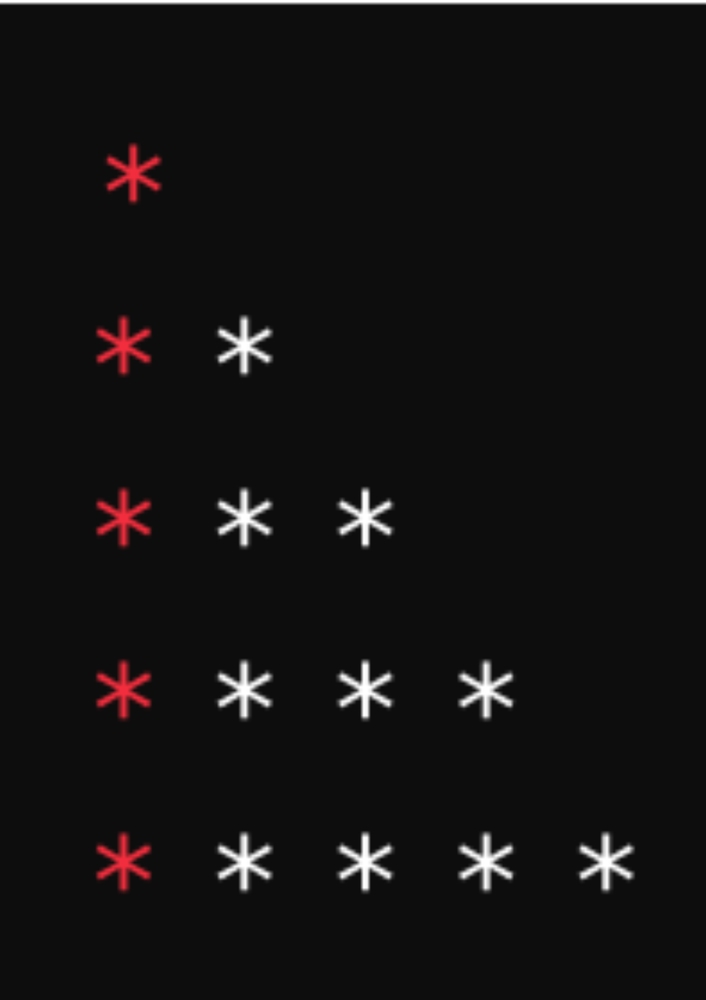

# Day 4: Loops

### Tasks/Activities:

#### Activity 1: For Loop
- Task 1: Write a program to print numbers from 1 to 10 using a for loop.
- Task 2: Write a program to print the multiplication table of 5 using a for loop.

#### Activity 2: While Loop
- Task 3: Write a program to calculate the sum of numbers from 1 to 10 using a while loop.
- Task 4: Write a program to print numbers from 10 to 1 using a while loop.

#### Activity 3: Do... While Loop
- Task 5: Write a program to print numbers from 1 to 5 using a do... while loop.
- Task 6: Write a program to calculate the factorial of a number using a do... while loop.

#### Activity 4: Nested Loops
- Task 7: Write a program to print a pattern using nested for loops:
(ignore color)

